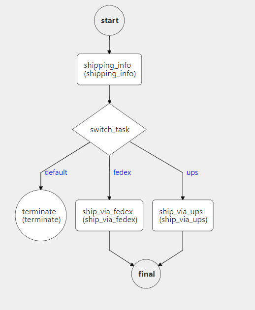

# Terminate

```json
"type" : "TERMINATE"
```
### Introduction
Task that can terminate a workflow with a given status and modify the workflow's output with a given parameter, 
it can act as a `return` statement for conditions where you simply want to terminate your workflow. 

### Use Cases
Use it when you want to terminate the workflow without continuing the execution.  
For example, if you have a decision where the first condition is met, you want to execute some tasks, 
otherwise you want to finish your workflow.

### Configuration

Terminate task is defined directly inside the workflow with type
`TERMINATE`.

```json
{
  "name": "terminate",
  "taskReferenceName": "terminate0",
  "inputParameters": {
      "terminationStatus": "COMPLETED",
      "workflowOutput": "${task0.output}"
  },
  "type": "TERMINATE",
  "startDelay": 0,
  "optional": false
}
```

#### Inputs

**Parameters:**

| name              | type   | description                             | notes                   |
|-------------------|--------|-----------------------------------------|-------------------------|
| terminationStatus | String | can only accept "COMPLETED" or "FAILED" | task cannot be optional |
| workflowOutput    | Any    | Expected workflow output                ||
|terminationReason|String| For failed tasks, this reason is passed to a failureWorkflow|

### Output

**Outputs:**

| name   | type | description                                                                                               |
|--------|------|-----------------------------------------------------------------------------------------------------------|
| output | Map  | The content of `workflowOutput` from the inputParameters. An empty object if `workflowOutput` is not set. |

### Examples

Let's consider the same example we had in [Switch Task](switch-task.md).

Suppose in a workflow, we have to take decision to ship the courier with the shipping
service providers on the basis of input provided while running the workflow.
If the input provided while running workflow does not match with the available
shipping providers then the workflow will fail and return. If input provided 
matches then it goes ahead.

Here is a snippet that shows the default switch case terminating the workflow:

```json
{
  "name": "switch_task",
  "taskReferenceName": "switch_task",
  "type": "SWITCH",
  "defaultCase": [
      {
      "name": "terminate",
      "taskReferenceName": "terminate",
      "type": "TERMINATE",
      "inputParameters": {
          "terminationStatus": "FAILED",
          "terminationReason":"Shipping provider not found."
      }      
    }
   ]
}
```

Workflow gets created as shown in the diagram.




### Best Practices
1. Include termination reason when terminating the workflow with failure status to make it easy to understand the cause.
2. Include any additional details (e.g. output of the tasks, switch case etc) that helps understand the path taken to termination.
