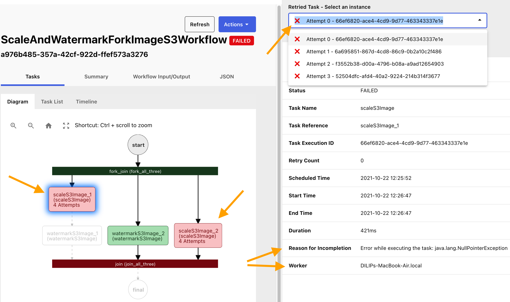

# Debugging Workflows

Conductor UI is a tool that we can leverage for debugging issues. Refer to the following articles to search and view
your workflow execution.

1. [Searching Workflows](/how-tos/Workflows/searching-workflows.html)
2. [View Workflow Executions](/how-tos/Workflows/view-workflow-executions.html)

## Debugging Executions

Open the **Tasks > Diagram** tab to see the diagram of the overall workflow execution

If there is a failure, you will them on the view marked as red. In most cases it should be clear what went wrong from
the view itself. To see details of the failure, you can click on the failed task.

The following fields are useful in debugging

| Field Name                                      | Description                                                                                                                   |
|-------------------------------------------------|-------------------------------------------------------------------------------------------------------------------------------|
| Task Detail > Summary > Reason for Incompletion | If an exception was thrown by the worker, it will be captured and displayed here                                              |
| Task Detail > Summary > Worker                  | The worker instance id where this failure last occurred. Useful to dig for detailed logs if not already captured by Conductor |
| Task Detail > Input                             | Verify if the task inputs were computed and provided correctly to the task                                                    |
| Task Detail > Output                            | If output of a previous task is used as an input to your next task, refer here for what was produced                          |
| Task Detail > Logs                              | If your task is supplying logs, we can look at that here                                                                      |
| Task Detail > Retried Task - Select an instance | If your task was retried, we can see all the attempts and correponding details here                                           |

Note: We can also access the task list from **Tasks > Task List** tab.

Here is a screen grab of the fields referred above.

## Recovering From Failures

Once we have resolved the underlying issue of workflow execution failure, we might want to replay or retry failed
workflows. The UI has functions that would allow us to do this:

The **Actions** button provides the following options:

|Action Name|Description|
|---|---|
| Restart with Current Definitions | Restart this workflow from the beginning using the same version of the workflow definition that originally ran this workflow execution. This is useful if the workflow definition has changed and we want to retain this instance to the original version|
| Restart with Latest Definitions | Restart this workflow from the beginning using the latest definition of the workflow. If we made changes to definition, we can use this option to re-run this flow with the latest version| 
| Retry - From failed task | Retry this workflow from the failed task| 

 

> **Note:** Conductor configurations allow your tasks to be retried automatically for transient failures.
> Refer to the task configuration options on how to leverage this.  
